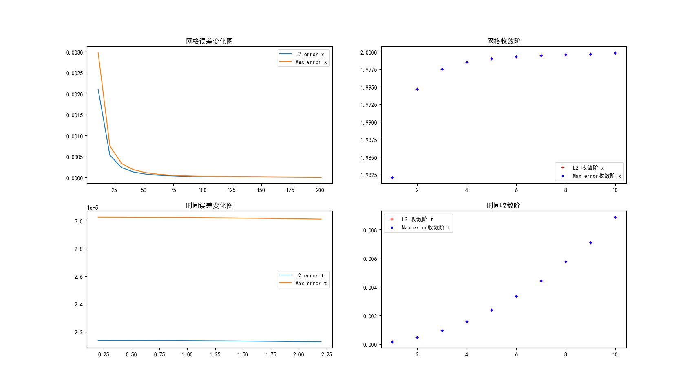

# 1D-Heat-Equation-Crank-Nicolson

简介：实现并验证一维热方程 \(u_t=u_{xx}\) 的 Crank–Nicolson 数值格式（Python），并用解析解进行误差与收敛性验证。

关键结果（示例）：
- Demo (nx=101): L2 error ≈ 2.14e-05, max error ≈ 3.02e-05.
- 空间收敛阶（L2）估计 ≈  1.99984（接近理论二阶）。
结果展示：



运行：
```bash
pip install -r requirements.txt
python main.py